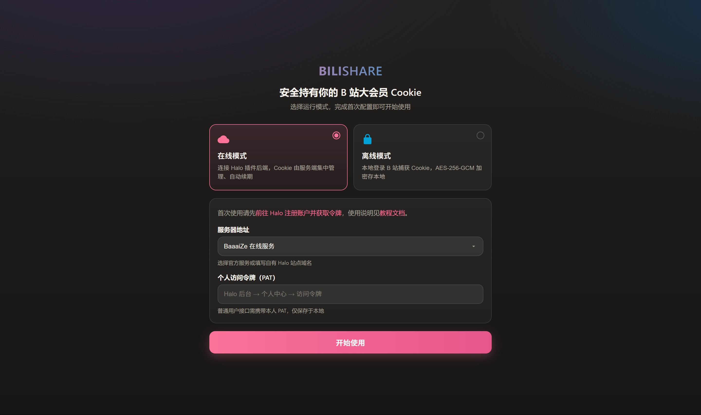
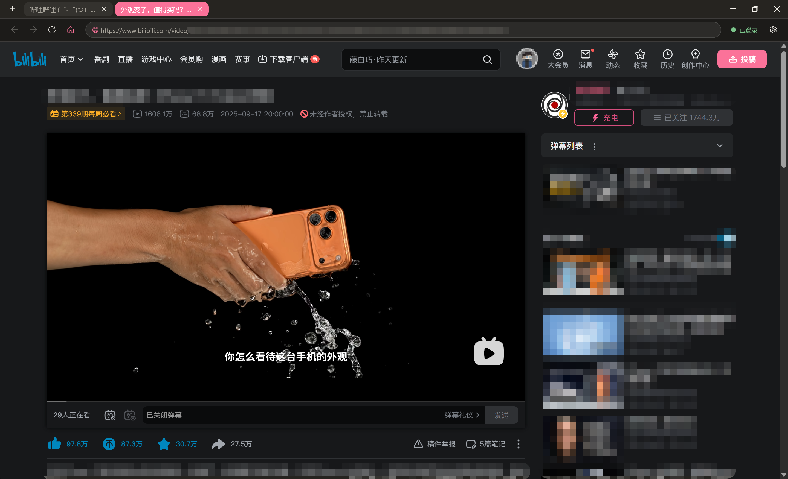
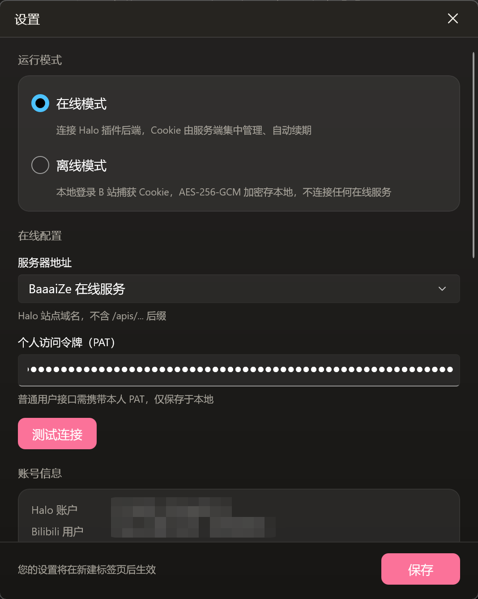

> **由 AI 辅助生成 · The project is AI-assisted.** 本项目由 AI 协助编写与完善，可能存在缺陷，请在使用前充分评估。

<div align="center">

# BiliShare

**B 站大会员 Cookie 安全共享桌面客户端**

安全获取并持有你的 B 站大会员 Cookie，在线/离线双模式共享，多标签浏览 · AES-256-GCM 加密 · 自动更新

[在线服务](#在线模式) · [离线模式](#离线模式) · [下载](#下载与安装) · [构建](#从源码构建)


</div>

---

## 简介

BiliShare 是一个 Windows 桌面浏览器客户端，以**安全持有 B 站大会员 Cookie** 为核心目标，让你在任何设备上安全、便捷地使用大会员权益（高清/付费内容）。

软件采用 **WinUI 3 + .NET 8 + WebView2** 构建，提供**在线**与**离线**两种运行模式，由你自由切换，兼顾云端共享的便利与本地隐私的自主。

---

## 功能亮点

- 🗂️ **双模式运行**：在线模式连接 Halo 插件后端集中管理 Cookie（自动续期）；离线模式本地获取、加密存储，不依赖任何在线服务。
- 🔖 **多标签浏览**：共享同一登录态，多标签自由切换，隐藏系统标题栏，后退/前进/刷新/主页一应俱全。
- 🛡️ **安全加固**：域名白名单拦截、新窗口转标签页、全屏支持、设备指纹（buvid3/buvid4）自动注入。
- 🔐 **本地加密**：离线 Cookie 使用 AES-256-GCM 加密持久化，密钥随机生成，永不硬编码。
- 🔁 **Cookie 全生命周期**：获取 · 导入 / 导出（`.bilicookie`）· 本地续期 · 上传云端 · 在线 / 本地双端校验。
- ⚙️ **设置中心**：模式切换、服务端连接测试、账号信息、Cookie 管理、清除所有数据一键恢复。
- 🔄 **自动更新**：检查 GitHub Releases 最新版本，一键下载便携包覆盖升级，更新不触碰你的数据。

---

## 截图

| 首次引导 · 模式选择 | 主界面 · 多标签浏览 |
|---|---|
|  |  |

| 设置 · 在线配置 & 账号信息 | 设置 · Cookie 管理 & 关于更新 |
|---|---|
|  |  |

---

## 运行模式

### 在线模式

Cookie 由**服务端集中管理**，客户端按需拉取并自动续期。

- 连接 Halo 插件后端（PAT 鉴权），选择官方「BaaaiZe 在线服务」或填写自有 Halo 站点域名。
- 默认对接的 Halo 后端插件为 [**bili-cookie**](https://github.com/baize520mc/bili-cookie)，它负责在服务端安全托管并自动续期 Cookie；如需自建服务端，可部署该插件到你的 Halo 站点。
- 启动时自动拉取 Cookie → 补全设备指纹 → 注入 WebView2 → 进入 B 站。
- 服务端统一管理 cookie、refresh_token，自动续期，多设备共享同一登录态。

### 离线模式

Cookie 完全**本地获取、本地加密存储**，不连接任何在线服务。

- 通过内置登录窗口登录 B 站（支持密码 / 手机验证码），客户端自动捕获 `SESSDATA`、`bili_jct`、`refresh_token` 等字段。
- Cookie 使用 AES-256-GCM 加密保存到本机，密钥随机生成，支持导入 / 导出 `.bilicookie` 文件迁移。
- 支持本地自动续期（B 站 6 步协议）与有效性校验。

---

## 下载与安装

从 [Releases](https://github.com/baize520mc/BiliShare/releases) 下载最新版本，两种方式任选：

| 方式 | 说明 |
|---|---|
| **安装包** `BiliShare_Setup_*.exe` | Inno Setup 安装程序，默认安装到「安装包所在目录\BiliShare」，无需管理员权限，界面即开即用 |
| **便携版** `BiliShare_*_portable.zip` | 解压后双击 `BiliShare.exe` 即可使用，适合 U 盘 / 免安装场景 |

> 所有数据均保存在软件根目录 `data/` 下。删除整个软件目录即彻底清除，系统不留任何残留。

---

## 快速开始

1. 首次启动进入**引导页**，选择运行模式。
2. **在线模式**：填写服务器地址与个人访问令牌（PAT）→ 测试连接 → 开始使用。
3. **离线模式**：进入设置页点击「获取 Cookie」，在弹出的登录窗口登录 B 站，捕获后自动加密保存。

> 修改设置后，**需新建标签页**方可生效（Cookie 注入在标签页导航前完成）。

---

## 设置中心

| 板块 | 功能 |
|---|---|
| 运行模式 | 切换在线 / 离线，配置随模式独立保存 |
| 服务端连接 | 地址（官方 / 自定义）· PAT · 测试连接 |
| 账号信息 | B 站用户名 / UID · Halo 用户名 · Cookie 有效期 · 上次刷新时间 |
| Cookie 管理 | 获取 · 导入 / 导出 · 刷新（本地续期 / 线上刷新）· 验证 · 上传覆盖 |
| 关于与更新 | 当前版本 · 检查更新一键升级 |
| 危险操作 | 清除所有数据并恢复初始状态 |

---

## 安全设计

- **域名白名单**：仅放行 `.bilibili.com / .hdslb.com / .bilivideo.com / .biligc.com` 及 `about:/file:/data:` 协议，新窗口一律转为当前窗口内新标签，杜绝外链跳转。
- **Cookie 加密**：离线模式 AES-256-GCM 加密，密钥随机生成并加密存放，`cookie.dat` / `key.dat` 分离存储。
- **独立登录环境**：登录窗口使用独立的 WebView2 环境，与主浏览器 Cookie 完全隔离。
- **数据零残留**：一切数据落于软件根目录 `data/`，删除目录即彻底清除，不写入系统目录。
- **更新无感**：自动更新仅覆盖程序文件，绝不触碰 `data/`（配置、Cookie、日志全部保留）。

---

## 技术栈

| 层 | 技术 |
|---|---|
| UI | WinUI 3 (Windows App SDK 1.7.x)，自定义「BiliShare Night」暖黑 + B站粉主题 |
| 运行时 | .NET 8, Windows 10/11 x64 |
| 浏览器内核 | WebView2（WebView2Loader + 独立运行环境） |
| 加密 | AES-256-GCM，`System.Security.Cryptography` |
| 服务端对接 | Halo bili-cookie 插件 REST API（Bearer PAT 鉴权） |
| 打包 | Inno Setup 安装包 + 7-Zip 便携包 |

---

## 项目结构

```
BiliShare/
├── BiliShare.sln
├── src/BiliShare/
│   ├── BiliShare.csproj
│   ├── App.xaml(.cs)             # 入口、主题、全局异常
│   ├── MainWindow.xaml(.cs)      # 主浏览器：标签栏 / 导航 / 全屏
│   ├── Views/
│   │   ├── SetupWindow.xaml(.cs)    # 首次引导
│   │   ├── SettingsWindow.xaml(.cs) # 设置中心
│   │   └── LoginWindow.xaml(.cs)    # 登录捕获
│   ├── Models/                   # AppConfig / ApiModels / LocalCookie ...
│   ├── Services/
│   │   ├── ApiClient.cs          # 服务端 REST 客户端
│   │   ├── CryptoService.cs      # AES-256-GCM 加密
│   │   ├── LocalCookieService.cs # 本地 Cookie 存取
│   │   ├── CookieInjector.cs     # Cookie 注入 WebView2
│   │   ├── FingerprintService.cs # 设备指纹
│   │   ├── BiliAuthService.cs    # B 站登录 / 续期 / 校验
│   │   ├── UpdateService.cs      # 自动更新
│   │   └── DataCleaner.cs        # 清除数据并重启
│   ├── Assets/                   # 应用图标
│   └── wwwroot/                  # 引导页 HTML/CSS/JS
├── scripts/                      # 构建 / 打包 / 发布脚本
└── docs/
```

---

## 从源码构建

详见 [BUILD.md](BUILD.md)。准备工作：

1. **Visual Studio**（含 UWP/C++ 与 MSVC 工作负载），`dotnet build` 无法生成 PRI 资源，必须使用 VS 的 MSBuild。
2. **Inno Setup 6**（生成安装包）、**7-Zip**（生成便携包）。
3. Windows App SDK 1.7.x，`RuntimeIdentifier = win-x64`。

一键发布（编译 → 精简 → 安装包 → 便携包 → 发布 GitHub Release）：

```powershell
powershell -NoProfile -ExecutionPolicy Bypass -File .\scripts\build-release.ps1
```

> 构建前请先关闭正在运行的 BiliShare 进程，避免 exe 文件被占用。

---

## 免责声明

本项目仅供学习与个人使用。请遵守 B 站《用户协议》与《社区规范》，请勿将 Cookie 用于任何非法或损害平台利益的活动。Cookie 属于敏感凭据，请妥善保管，勿随意分享给他人。因使用本项目产生的一切后果由使用者自行承担。

---

## 许可证

本仓库未附带正式许可证文件，默认保留所有权利（All Rights Reserved）。如需商用或分发，请联系作者授权。

---

## 关于本项目

本项目由 **AI 辅助生成**。代码、界面与文档在人工需求确认与指导的基础上，由 AI 协助编写与完善。生成内容可能存在未知缺陷，请在使用前充分评估，并善用开源社区与文档资源进行核查与改进。